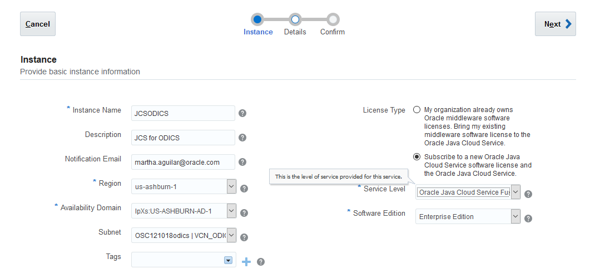
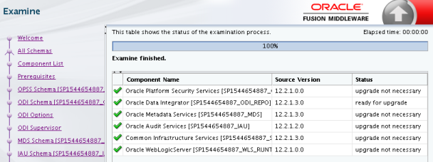

# Install ODICS in OCI

Log into Oracle cloud and navigate to OCI

## Prerequisites for a DBCS in OCI

### **Create a Compartment**

1.  Navigate Menu: Identity > Compartments

2.  Click on button "Create Compartment" at the top of the screen

3.  Provide a name. For example: OSC121018odics

4.  Click on button "Create Compartment" at the bottom of the screen

### **Create a VCN (Virtual Cloud Network)**

1.  Navigate Menu: Networking > Virtual Cloud Networks

2.  Verify that your compartment is selected in the compartment drop down menu on the left side of your screen

3.  Click on button "Virtual Cloud Network" at the top of the screen

4.  Select your compartment

5.  Provide a name. For example: VCN\_ODICS

6.  Select "Create Virtual Cloud Network plus related resources", this will default the options

7.  Click on button "Create Virtual Cloud Network" at the bottom of the screen

### **Create a Policy to Permit Oracle Platform Services to create instances in your VCN**

1.  Navigate Menu: Identity > Policies

2.  Click on button "Create Policy" at the top of the screen

3.  Provide name. For example: osc121018VCNpolicy

4.  Provide description

5.  Leave "Keep Policy Current"

6.  Add the following Statements

 a. Allow service PSM to inspect vcns in compartment \<compartment\_name\>
 b. Allow service PSM to use subnets in compartment \<compartment\_name\>
 c. Allow service PSM to use vnics in compartment \<compartment\_name\>
 d. Allow service PSM to manage security-lists in compartment \<compartment\_name\>
 e. Allow service PSM to manage all-resources in compartment \<compartment\_name\>

7\.  Click on button "Create" at the bottom of the screen

### **Create a Storage Bucket**

1.  Navigate Menu \> Object Storage \> Object Storage

2.  Verify that your compartment is selected in the compartment drop down menu on the left side of your screen

3.  Click on button "Create Bucket" at the top of the screen

4.  Provide a name. For example: ODICS\_STORAGE1

5.  Click on button "Create Bucket" at the bottom of the screen

### **Create the URL to the Storage Bucket**

1.  While you are in the Storage Bucket screen copy the URL on top of your browser. It should look something like: <https://console.us-ashburn-1.oraclecloud.com/a/storage/objects>

2.  Replace your information in the following URL: 

 a.  In our example region would be "us-ashburn-1"
 b.  In our example namespace would be "oscnas001" (your tenancy). Click on the icon that looks like a person on the top right of your screen and you will be able to see your tenancy
 c.  In our example container would be "ODICS\_STORAGE1". The Storage Bucket you just created

So the URL will look something like: <https://swiftobjectstorage.us-ashburn-1.oraclecloud.com/v1/oscnas001/ODICS_STORAGE1>. Make a note of this will require it later in the process

### **Setup credential to have access to the bucket**

1.  Navigate Menu: Identity > Users

2.  Click on button "Create User" at the top of the screen

3.  Provide name (use format name.lastname@company.com. For example: martha.aguilar@oracle.com

4.  Provide description

5.  Click on button "Create" at the bottom of the screen

6.  Drilldown in the user you just created

7.  Navigate to "Auth Tokens" (look for the hyperlink on the bottom left of the screen)

8.  Click on button "Generate Token"

9.  Provide description

10. Click on button "Generate Token" at the bottom of the screen

11. Make a note of the token immediately. [You will NOT be able to retrieve it again]{.underline} after closing the dialog box, you will require it later in the process

12. Navigate to "Groups" (look for the hyperlink on the bottom left of the screen)

13. Click on button "Add User to Group"

14. From the groups drop down select "Administrators"

15. Click on button "Add" at the bottom of the screen

## Create a DBCS in OCI

1.  Navigate to your services dashboard

2.  Navigate to "Database Classic" console

3.  Click on "Create Instance" button located on the top right of your screen

4.  Provide:

 a.  Name. For example: DBCS-ODICS. Make a note of this
 b.  Description
 c.  Select a region. For example: us-ashburn-1
 d.  Select an availability domain. For example: lpXs: US-ASHBURN-AD-1
 e.  Select the subnet you created in section that is a combination of your compartment, VCN name and subnet name. For example: OSC121018 \| VCN\_ODICS \| Public Subnet lpXs: US-ASHBURN-AD-1
 f.  License Type. For example: Subscribe ...
 g.  Software Release. For example: Oracle Database 12c Release 2
 h.  Software Edition. For example: Enterprise edition
 i.  Database type. For example: Single Instance

{width="6.5in" height="2.64375in"}

5.  Click on "Next" button located on the top right corner of the screen

6.  Provide:

 a.  DB Name. Leave default (ORCL). Make a note of this
 b.  PDB Name. Leave default (PDB1). Make a note of this
 c.  Administration Password. Provide your password. Make a note of this
 d.  Confirm Password.
 e.  Usable Database Storage. For example: 100
 f.  Compute Shape. For example: VM.Standard2.2 -- 2.0 OCPU, 30 GB RAM
 g.  SSH Public Key. Either generate and save your keys or navigate and upload your public key
 h.  Backup Destination. Select "Both Cloud Storage and Local Storage"
 i.  Cloud Storage Container. Provide the value you put together in section "**Create the URL to the Storage Bucket**". For example: <https://swiftobjectstorage.us-ashburn-1.oraclecloud.com/v1/oscnas001/ODICS_STORAGE1>
 j.  Username. Provide the user created in section "**Setup credential to have access to the bucket**". For example: <martha.aguilar@oracle.com>
 k.  Password. Provide the OAuth Token generated in section "**Setup credential to have access to the bucket**" step 10
{width="6.5in" height="2.6131944444444444in"}

7.  Click on "Next" button located on the top right corner of the screen. If there is a problem with the access to the storage, an error message will be sent to screen.

8.  If all verifications went OK, you will be in the Summary screen. Click on "Create" button. This process will take around 30 min

## Prerequisites for a DBaaS in OCI

### **Create a Compartment**

1.  Navigate Menu \> Identity \> Compartments

2.  Click on button "Create Compartment" at the top of the screen

3.  Provide a name. For example: OSC121018odics

4.  Click on button "Create Compartment" at the bottom of the screen

### **Create a VCN (Virtual Cloud Network)**

1.  Navigate Menu \> Networking \> Virtual Cloud Networks

2.  Verify that your compartment is selected in the compartment drop down menu on the left side of your screen

3.  Click on button "Virtual Cloud Network" at the top of the screen

4.  Select your compartment

5.  Provide a name. For example: VCN\_ODICS

6.  Select "Create Virtual Cloud Network plus related resources", this will default the options

7.  Click on button "Create Virtual Cloud Network" at the bottom of the screen

### **Create a Policy to Permit Oracle Platform Services to create instances in your VCN**

1.  Navigate Menu \> Identity \> Policies

2.  Click on button "Create Policy" at the top of the screen

3.  Provide name. For example: osc121018VCNpolicy

4.  Provide description

5.  Leave "Keep Policy Current"

6.  Add the following Statements

 a.  Allow service PSM to inspect vcns in compartment \<compartment\_name\>
 b.  Allow service PSM to use subnets in compartment \<compartment\_name\>
 c.  Allow service PSM to use vnics in compartment \<compartment\_name\>
 d.  Allow service PSM to manage security-lists in compartment \<compartment\_name\>
 e.  Allow service PSM to manage all-resources in compartment \<compartment\_name\>
 f.  Allow service PSM to inspect autonomous-database in compartment \<compartment\_name\>
 g.  Allow service PSM to inspect database-family in compartment \<compartment\_name\>

7\.  Click on button "Create" at the bottom of the screen

### **Create a Storage Bucket**

1.  Navigate Menu \> Object Storage \> Object Storage

2.  Verify that your compartment is selected in the compartment drop down menu on the left side of your screen

3.  Click on button "Create Bucket" at the top of the screen

4.  Provide a name. For example: ODICS\_STORAGE1

5.  Click on button "Create Bucket" at the bottom of the screen

### **Create the URL to the Storage Bucket**

1.  While you are in the Storage Bucket screen copy the URL on top of your browser. It should look something like: <https://console.us-ashburn-1.oraclecloud.com/a/storage/objects>

3.  Replace your information in the following URL: \>

 d.  In our example region would be "us-ashburn-1"
 e.  In our example namespace would be "oscnas001" (your tenancy). Click on the icon that looks like a person on the top right of your screen and you will be able to see your tenancy
 f.  In our example container would be "ODICS\_STORAGE1". The Storage Bucket you just created

So the URL will look something like: <https://swiftobjectstorage.us-ashburn-1.oraclecloud.com/v1/oscnas001/ODICS_STORAGE1>. Make a note of this will require it later in the process

### **Generate Authentication Tokens**

PaaS services need an authentication token to access Oracle Cloud Infrastructure Object Storage to store backups.

Generate an authentication token for each user who created buckets or has permission to access them. For example, if java\_user created a bucket for Java Cloud Service, and db\_user created a bucket for Database Cloud Service, then generate a separate authentication token for each of these users. If the same user created both the buckets or can access both buckets, then generate a single authentication token for that user.

1.  Sign in to the Oracle Cloud Infrastructure web console as the user who created the buckets or has permission to access them.

2.  Click the user icon at the upper right corner, and from the menu that appears, select User Settings.

3.  User Settings menu option

4.  In the Resources navigation pane, click Auth Tokens, and then click Generate Token.

5.  In the Generate Token dialog box, enter a description for the token, and then click Generate Token.

6.  Copy and store the generated token immediately. [You will NOT be able to retrieve it again]{.underline} after closing the dialog box, you will require it later in the process.

## Create a DBaaS

1.  Navigate Menu \> Bare Metal, VM, and Exadata

2.  Click on button "Launch DB System" at the top of the screen

3.  Provide a name. For example: ODICS\_Repo

4.  Provide an availability domain

5.  Leave the shape type as "Virtual Machine"

6.  Select the shape

7.  Select "Enterprise Edition" as the Oracle database software edition

8.  Select the required space for your repository

9.  Select the type of license you will require

> {width="3.5208333333333335in" height="3.7664555993000874in"}

10. Paste your public key (<https://www.oracle.com/webfolder/technetwork/tutorials/obe/cloud/javaservice/JCS/JCS_SSH/create_sshkey.html> )

11. On the Network Information section:

 a.  Select the VCN you created in section "create a VCN"
 b.  Select a subnet
 c.  Provide a Host name prefix, like ODICS

{width="3.8020833333333335in" height="2.8070308398950132in"}

12\. On Database Information section:

 d.  Provide a DB name, like ODICSREP (less than 8 alpha numeric characters)
 e.  Select a DB version, like 12.1.0.2
 f.  Provide the PDB name (or leave it as default -- PDB --)
 g.  Provide the administrator's password
 h.  Verify that option "Automatic Backup" is selected
 i.  Verify that "Database Workload" is OLTP
{width="3.4256944444444444in" height="4.104166666666667in"}

13\. Click on button "Launch DB System" at the bottom of the screen

## Provision the Oracle Java Cloud Instance for regular ODICS

1.  Navigate to your services dashboard

2.  Navigate to "Java" console

3.  Click on "Create Instance" button located on the top right of your screen

4.  Select "Java" from the drop-down list

{width="6.5in" height="1.9506944444444445in"}

5.  Provide:

 a.  Instance Name. For example: JCSODICS
 b.  Description
 c.  Select a region. For example: us-ashburn-1
 d.  Select an availability domain. For example: lpXs: US-ASHBURN-AD-1
 e.  Select the subnet you created in section "Create a VCN" and is a combination of your compartment, VCN name and subnet name. For example: OSC121018 \| VCN\_ODICS \| Public Subnet lpXs: US-ASHBURN-AD-1
 f.  License Type. For example: Subscribe ...
 g.  Service Level. Select "Oracle Java Cloud Service Fusion Middleware -- Oracle Data Integrator"
 h.  Software Edition. Select "Enterprise Edition"
{width="6.5in" height="2.9756944444444446in"}

6\.  Click on "Next" button located on the top right corner of the screen

7\.  Click on "Advanced" tab

8\.  Follow <https://www.oracle.com/webfolder/technetwork/tutorials/obe/cloud/javaservice/JCS/FMW_UpperStack_on_JCS/odi_on_jcs_obe/provisioning_oracle_data_integrator_cloud_service.html#section1> from section "Provisioning the Oracle Java Cloud Instance" step 4 on

**Note:** For backup destination use the following:

 u.  Cloud Storage Container. Provide the value you put together in section "**Create the URL to the Storage Bucket**". For example: <https://swiftobjectstorage.us-ashburn-1.oraclecloud.com/v1/oscnas001/ODICS_STORAGE1>
 v.  Username. Provide the user created in section "**Setup credential to have access to the bucket**". For example: <martha.aguilar@oracle.com>
 w.  Password. Provide the OAuth Token generated in section "**Setup credential to have access to the bucket**" step 10

## Provision the Oracle Java Cloud Instance for ODICS for ADW

1.  Navigate to your services dashboard
2.  Navigate to "Java" console
3.  Click on "Create Instance" button located on the top right of your screen
4.  Select "Java" from the drop-down list
{width="6.5in" height="1.9506944444444445in"}
5.  Provide:
 a.  Instance Name. For example: JCSODICS
 b.  Description
 c.  Select a region. For example: us-ashburn-1
 d.  Select an availability domain. For example: lpXs: US-ASHBURN-AD-1
 e.  Select the subnet you created in section "Create a VCN" and is a combination of your compartment, VCN name and subnet name. For example: OSC121018 \| VCN\_ODICS \| Public Subnet lpXs: US-ASHBURN-AD-1
 f.  License Type. For example: Subscribe ...
 g.  Service Level. Select "Oracle Java Cloud Service Fusion Middleware -- Oracle Data Integrator"
 h.  Software Edition. Select "Enterprise Edition"
{width="6.5in" height="2.9756944444444446in"}
6.  Click on "Next" button located on the top right corner of the screen
7.  Click on "Advanced" tab
8.  Follow <https://www.oracle.com/webfolder/technetwork/tutorials/obe/cloud/javaservice/JCS/FMW_UpperStack_on_JCS/odi_on_jcs_obe/provisioning_oracle_data_integrator_cloud_service.html#section1> from section "Provisioning the Oracle Java Cloud Instance" step 4 on

**Note:** For backup destination use the following:
 a.  Cloud Storage Container. Provide the value you put together in section "**Create the URL to the Storage Bucket**". For example: <https://swiftobjectstorage.us-ashburn-1.oraclecloud.com/v1/oscnas001/ODICS_STORAGE1>
 b.  Username. Provide the user created in section "**Setup credential to have access to the bucket**". For example: <martha.aguilar@oracle.com>
 c.  Password. Provide the OAuth Token generated in section "**Setup credential to have access to the bucket**" step 10
 9\.  Go on with section "Installing ODI on the Oracle Java Cloud Service" but in step 6 of subsection "Installing Oracle Data Integrator" (Auto Updates Screen) do the following:
 a.  Click on \"Search My Oracle Support for updates\"
 b.  Enter username (your user name for Oracle Support)
 c.  Enter password (your password for Oracle Support)
 d.  Click on Search.
{width="6.385416666666667in" height="4.922309711286089in"}
 e.  Select 22384876 13.9.3 PREFLIGHT ON FMW 12.2.1.3.1
 f.  Click on "Next" button
 g.  Click "Yes" on the popup \"Some of the updates require restart of the installer. Do you want to continue?\"
 h.  The installer will restart
10. On step 7, do NOT click on button "View" but otherwise continue the installation steps as provided in the document

**Important Note**
Instead of performing steps in section "Starting the Administration Server"
1.  Execute command: cd /u01/data/domains/JCSODICS\_domain/bin
2.  Execute command: ./startWebLogic.sh &
3.  Continue to the next section of the web document (<https://www.oracle.com/webfolder/technetwork/tutorials/obe/cloud/javaservice/JCS/FMW_UpperStack_on_JCS/odi_on_jcs_obe/provisioning_oracle_data_integrator_cloud_service.html> ) "Post-Configuration Tasks".
4.  Before you execute the steps in the next section of the document "Starting the Servers", apply the ODI patch, following the steps in the next section
 a.  Execute command: cd /u01/app/oracle/middleware/odi/studio/bin
 b.  Execute command: ./odi

## Apply ODI patch for ADW ODI version

1.  Get patch "26669648" from Oracle support. Read the README.txt document
2.  Prerequisites:
 a.  Verify your OPatch version. Execute commands:
  i.  cd /u01/app/oracle/middleware/OPatch
  ii. ./opatch version
   OPatch should be 13.3 or later
 b.  Verify the OUI Inventory. Execute command:
  iii. ./opatch lsinventory -jre \$JAVA\_HOME/jre
   This command should NOT error out
 c.  In user oracle's home edit file ".bashrc" and add the following lines at the end:

```
export ORACLE\_HOME=/u01/app/oracle/middleware
export PATH=\${ORACLE\_HOME}/OPatch:\${PATH}
```
3.  Log out from oracle and login back again
4.  If you started the weblogic servers, log into weblogic server and stop all servers and processes in the domain; that is admin server and node server (JCSODICS\_server\_1 and JCSODICS\_adminserver)
5.  Make sure ODI Studio is NOT running
6.  Unzip patch "26669648"
7.  Navigate into the patch directory (for example: /u01/app/oracle/tools/home/oracle/Patches/26669648)
8.  Execute command: opatch apply
9.  Once the patch is applied successfully, we need to upgrade the ODI schema repositories
 d.  Execute command: cd /u01/app/oracle/middleware/oracle\_common/upgrade/bin
 e.  Execute command: ./ua
 f.  Click "Next" in the ***Welcome*** screen
 g.  Select "All Schemas Used By a Domain" in screen ***Selected Schemas*** (once selected the name of the screen will change to ***All Schemas***)
 h.  Provide the directory of the weblogic domain:
  /u01/data/domains/JCSODICS\_domain

{width="6.375in" height="1.9375in"}
 i.  Click on "Next" button
 j.  The next screen, ***Component List***, will show a list of all the repositories under the selected domain that will be upgraded. Verify this is the domain you want to upgrade and that "Oracle Data Integrator" repository is in the list and click on "Next" button
{width="6.333333333333333in" height="2.0833333333333335in"}
 k.  The ***Prerequisites*** screen is just a list of items that you must check and verify before you can proceed. Check the boxes and then click on the "Next" button
{width="6.322916666666667in" height="1.6770833333333333in"}

**NOTE: The Upgrade Assistant will not verify that the prerequisites have been met**
  l.  On **[OPSS Schema]{.underline}** screen, provide the DB admin user (SYS as sysdba) and its password, then click the "Connect" button
  m.  The program gathers the necessary information for the following fields. Click on "Next" button
{width="6.3125in" height="2.40625in"}
  n.  On **[ODI Schema]{.underline}** screen, provide the DB admin user (SYS as sysdba) and its password, then click the "Connect" button
  o.  The program gathers the necessary information for the following fields. Click on "Next" button
{width="6.34375in" height="2.8541666666666665in"}
  p.  On ODI Options screen, select all the options available and then click on "Next" button
{width="6.364583333333333in" height="1.375in"}
 q.  On screen ***ODI Supervisor***, provide:
  iv. ODI Supervisor name: SUPERVISOR
  v.  ODI Supervisor Password: the password assigned to the SUPERVISOR user (for example Welcome\#1)
 r.  Once the information has been provided, click on the "Next" button
{width="6.375in" height="1.4270833333333333in"}
  s.  On **[MDS Schema]{.underline}** screen, provide the DB admin user (SYS as sysdba) and its password, then click the "Connect" button (if users and passwords are the same as the previous screens, the application will automatically provide them)
  t.  The program gathers the necessary information for the following fields. Click on "Next" button
{width="6.333333333333333in" height="2.6875in"}
 u.  On **[IAU Schema]{.underline}** screen, provide the DB admin user (SYS as sysdba) and its password, then click the "Connect" button (if users and passwords are the same as the previous screens, the application will automatically provide them)
 v.  The program gathers the necessary information for the following fields. Click on "Next" button
{width="6.416666666666667in" height="2.8229166666666665in"}
 w.  On **[STB Schema]{.underline}** screen, provide the DB admin user (SYS as sysdba) and its password, then click the "Connect" button (if users and passwords are the same as the previous screens, the application will automatically provide them)
 x.  The program gathers the necessary information for the following fields. Click on "Next" button
{width="6.385416666666667in" height="4.125in"}
 y.  On **[WLS Schema]{.underline}** screen, provide the DB admin user (SYS) and its password, then click the "Connect" button (if users and passwords are the same as the previous screens, the application will automatically provide them)
 z.  The program gathers the necessary information for the following fields. Click on "Next" button
{width="6.364583333333333in" height="2.4479166666666665in"}

a.  The Examine screen will provide a list of the available components and if they require or not and are ready or not for the upgrade. Click on the "Next" button

{width="6.333333333333333in" height="2.375in"}

b.  The ***Upgrade Summary*** screen will provide all the information about the processes that will be performed and the schemas in which they will be performed. Click on the "Upgrade" button to start the upgrade process, this will take some time so be patient

{width="6.322916666666667in" height="3.2395833333333335in"}

c.  The ***Upgrade Progress*** screens shows information about the progress of the upgrade. Click on the "Next" button

{width="6.385416666666667in" height="1.7604166666666667in"}

d.  The ***Upgrade Success*** screen summarizes the upgrade. Click on "Close" button

{width="6.354166666666667in" height="2.9583333333333335in"}

10. Clearing of the JDev cache is required.

    e.  Execute command: cd /u01/app/oracle/tools/home/oracle/.odi

    f.  Execute command: rm -rf system12.2.1.3.0

11. Return to web document (<https://www.oracle.com/webfolder/technetwork/tutorials/obe/cloud/javaservice/JCS/FMW_UpperStack_on_JCS/odi_on_jcs_obe/provisioning_oracle_data_integrator_cloud_service.html> ) section "Post-Configuration Tasks".

[]{#_Toc4066651 .anchor}Appendix A - VCN Images{width="6.5in" height="8.057638888888889in"}{width="6.3694444444444445in" height="9.0in"}

{width="6.40625in" height="7.395833333333333in"}

## Appendix B - Resources

How to provision the pre-requisites for DBCS

https://docs.cloud.oracle.com/iaas/Content/General/Reference/PaaSprereqs.htm\#prereqs

Tutorial of provisioning ODI-CS

ODI 12c on JCS

https://www.oracle.com/webfolder/technetwork/tutorials/obe/fmw/odi/odi\_12c/odi\_12c\_on\_jcs/odi\_on\_jcs.html\#section2

Creating SSH keys for Use with Oracle Cloud Services

<https://www.oracle.com/webfolder/technetwork/tutorials/obe/cloud/javaservice/JCS/JCS_SSH/create_sshkey.html>

Documentation on ODICS

<https://docs.oracle.com/en/cloud/paas/data-integrator-cloud/user/using-oracle-data-integrator-cloud.pdf>

Provisioning Oracle Data Integrator Cloud Service tutorial

[https://www.oracle.com/webfolder/technetwork/tutorials/obe/cloud/javaservice/JCS/FMW\_UpperStack\_on\_JCS/odi\_on\_jcs\_obe/provisioning\_oracle\_data\_integrator\_cloud\_service.htm](https://www.oracle.com/webfolder/technetwork/tutorials/obe/cloud/javaservice/JCS/FMW_UpperStack_on_JCS/odi_on_jcs_obe/provisioning_oracle_data_integrator_cloud_service.html#section3s7)

Upgrading ODI Schemas

<https://docs.oracle.com/middleware/1212/odi/ODIUG/tasklist.htm#ODIUG369>

versions for ODI for ADW

JCS with Weblogic 12.2.1.3.0

Install ODI 12.2.1.3.0 manually

Apply patch 26669648 (12.2.1.3.1)

DBCS (Classic) PSM image so it is deployed in OCI infrastructure

Install ODI on top of JCS -\> ODI uses JCS as a container of tasks (agent)

JCS will create a WL cluster and ODI will create an agent in that WL cluster

SUPERVISOR password can be 12 characters long maximum

Repositories passwords can be 10 characters long maximum
